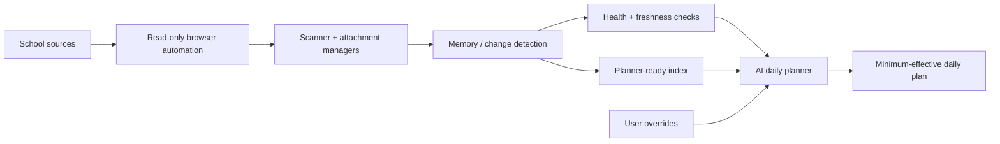

# Rayth ScholarOS

**A student-built AI school assistant that turns noisy school data into a small, actionable daily study plan.**

Rayth ScholarOS started as a personal project to solve a real problem: school information was spread across Classroom, email, attachments, task sheets, and changing deadlines. I wanted a system that could collect that information, preserve useful history, filter out noise, and give me a realistic daily plan instead of another giant to-do list.

This repository is the **public, privacy-safe portfolio version** of that project. It contains architecture, sample data, and representative logic. The live personal deployment is kept private because it processes school and account data.

## What the system does

- Collects assignment, material, announcement, and attachment metadata from school sources
- Detects new and updated information while retaining previous good data when a scan fails
- Tracks whether each class was scanned with fresh data or had to use fallback data
- Separates resources and "Assigned" labels from genuine action signals
- Builds a compact planner-facing dataset instead of asking an AI model to parse huge browser logs
- Supports explicit user overrides for things the automated sources cannot know
- Produces health/status output so downstream planning can decide whether a run is trustworthy
- Keeps the live system read-only toward school platforms

## Why I built it

I wanted to learn AI and software engineering by building something I actually use. The project forced me to work on problems that tutorials often skip:

- unreliable browser automation
- changing page structure and selectors
- duplicate detection
- state and memory across runs
- fallbacks when fresh data is unavailable
- separating evidence from assumptions
- privacy when AI is involved
- designing outputs for another AI system to consume safely

## Architecture



More detail: [docs/architecture.md](docs/architecture.md)

## Engineering ideas demonstrated

### Reliability
The live system does not blindly overwrite its last good snapshot when one class fails. It can retain older data for the failed class while still saving fresh data from classes that succeeded.

### State
Items receive stable keys so the system can distinguish genuinely new information from things it has already seen.

### Data quality
The planner tracks whether information is **FRESH**, **FALLBACK**, **PARTIAL**, or **MISSING** rather than pretending every successful script run produced perfect data.

### Noise filtering
A Classroom "Assigned" label is not automatically treated as homework. The planner looks for stronger evidence such as explicit deadlines, assessment wording, teacher instructions, or recent changes.

### Privacy
The public repository contains no real school emails, authentication tokens, browser profiles, private Drive IDs, teacher/student records, or downloaded school documents.

## Public demo

The live automation is intentionally not published verbatim. Instead, this repo includes:

- [src/school_pipeline_demo.js](src/school_pipeline_demo.js) — representative planner/classification logic using fake data
- [examples/sample_planner_daily.csv](examples/sample_planner_daily.csv) — sanitized planner output
- [examples/sample_run_status.csv](examples/sample_run_status.csv) — sanitized health status
- [docs/privacy-and-ai.md](docs/privacy-and-ai.md) — what AI does, what it does not do, and how private data is handled
- [docs/project-evolution.md](docs/project-evolution.md) — how the project evolved through multiple versions

## Example decision

Input:

```text
Classroom status: Assigned
Title: Revision worksheet
Due date: none
Teacher message: none
```

Output:

```text
Signal: RESOURCE / UNCONFIRMED_ASSIGNED
Action: Do not automatically add homework
Reason: "Assigned" alone is not enough evidence
```

A different item with a real deadline or explicit teacher instruction is promoted in priority.

## AI's role

AI is used as the **reasoning layer after data collection**, not as a replacement for deterministic collection and state tracking. The automation first produces structured evidence. The AI planner then decides what deserves attention under workload constraints.

I use AI as a development tool as well: for code review, debugging ideas, test cases, and design discussion. I still define the problem, choose the architecture, test the system, inspect failures, and decide which changes to keep.

See [docs/privacy-and-ai.md](docs/privacy-and-ai.md).

## Project evolution

The project has moved from a simple study-tool idea toward a real personal automation system:

- **Early version:** notes, flashcards, quizzes, and study-planner experiments
- **Scanner versions:** persistent school snapshots and change detection
- **Attachment versions:** safe indexing/downloading of newly discovered files
- **Current planner architecture:** compact planner-facing index, class configuration, fallbacks, health tracking, overrides, and class discovery
- **Next reliability work:** stronger fallback matching for Classroom detail pages, better Gmail attachment identification, adaptive waits, and clearer "completed with warnings" health states

## What I learned

The biggest lesson has been that useful AI systems are not only about prompts or models. They need reliable inputs, explicit state, failure handling, privacy boundaries, and outputs that make uncertainty visible.

## Repository safety

Do **not** commit:

- exported Classroom/Gmail data
- school documents or assessment files
- browser profiles/cookies
- API keys or tokens
- real Drive IDs
- logs from the live automation

The included `.gitignore` blocks the main classes of local/private output.

## Status

**Active personal project.** The public repo is a portfolio-safe representation of a private system that I continue to iterate and use.

---

Built by a Grade 12 student learning software engineering, automation, and applied AI by solving problems in daily life.
