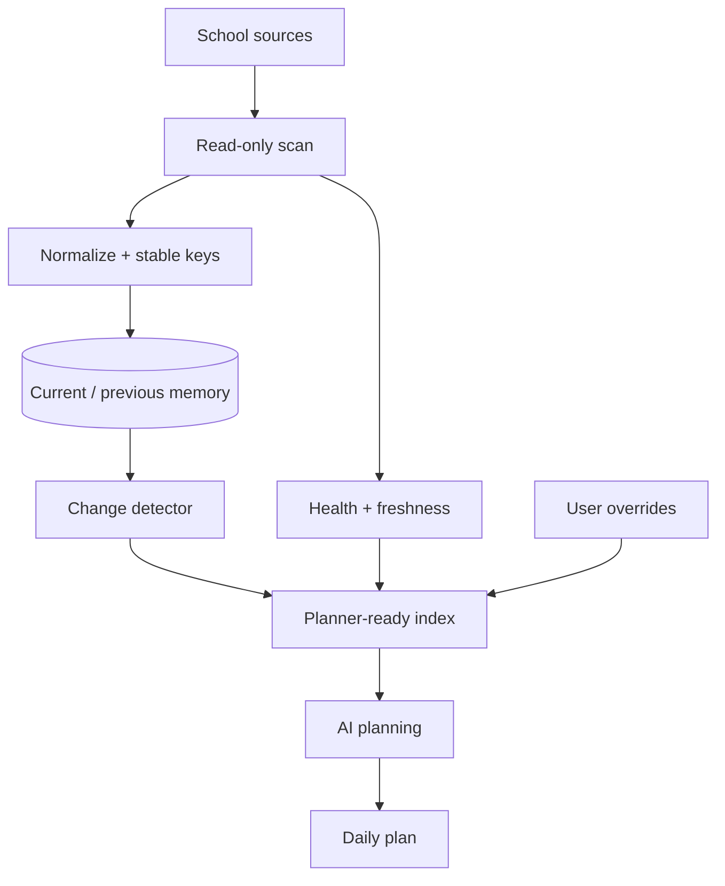

# Architecture

Rayth ScholarOS separates deterministic collection from AI reasoning.

## 1. Collection layer

A read-only browser automation layer scans configured school sources. The goal is to collect evidence, not make decisions.

Typical evidence includes:

- assignment title and status
- due date when visible
- material title
- announcement text
- attachment metadata
- source and scan timestamp

The personal deployment uses an editable class configuration with multiple aliases so a class can still be matched when its visible name changes.

## 2. Memory and identity

Every item is normalized and assigned a stable key. Previous snapshots are retained so a later run can classify an item as new, updated, already known, or historical coverage that was simply discovered late.

This prevents the system from treating every page render as new information.

## 3. Failure handling

A scanner failure should not erase good historical data. The live design keeps successful fresh rows and can restore the last known rows for a class whose scan failed.

Planner-facing status distinguishes:

- **FRESH** — collected in the current run
- **FALLBACK** — previous good data retained
- **PARTIAL** — some current collection succeeded but a component failed
- **MISSING** — no usable data is available

## 4. Attachment/detail layer

The system indexes attachments and remembers what has already been seen so old files are not repeatedly downloaded.

Detailed Classwork pages are inspected selectively instead of bulk-opening every historical item. A small queue prioritizes changed or active items.

## 5. Planner index

Rather than feed massive raw logs into an AI model, the system generates a compact planner-facing table containing only items with credible relevance: deadlines, changes, assessment signals, explicit action wording, or user-confirmed overrides.

## 6. AI planning layer

The AI planner consumes structured evidence and applies planning rules such as:

- nearest assessments first
- real deadlines before general revision
- do not infer homework from "Assigned" alone
- prefer active study methods
- respect daily workload ceilings
- allow a zero-minute plan when nothing useful is required
- surface uncertainty instead of inventing requirements

## Data flow

## Design principle

The system is intentionally conservative: **missing or uncertain evidence should reduce confidence, not create fake work.**
